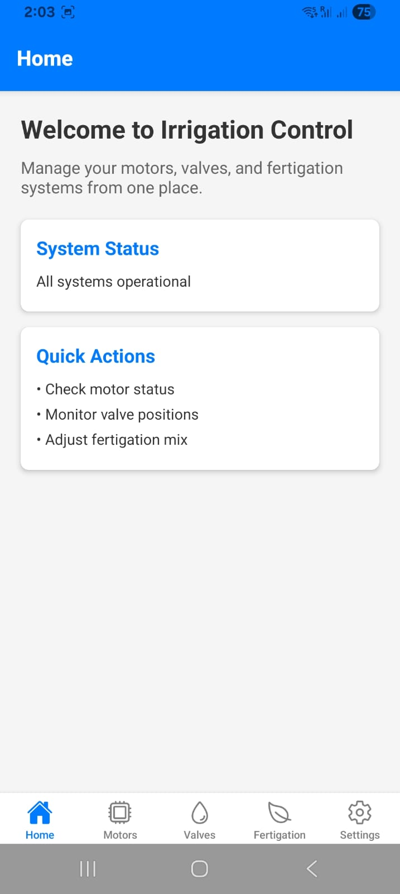
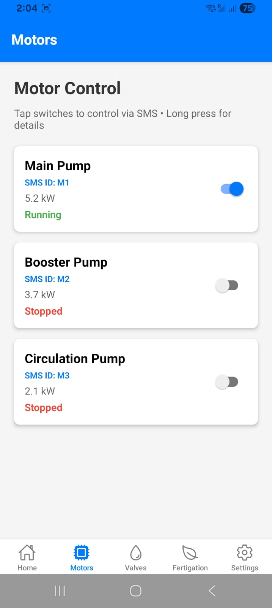
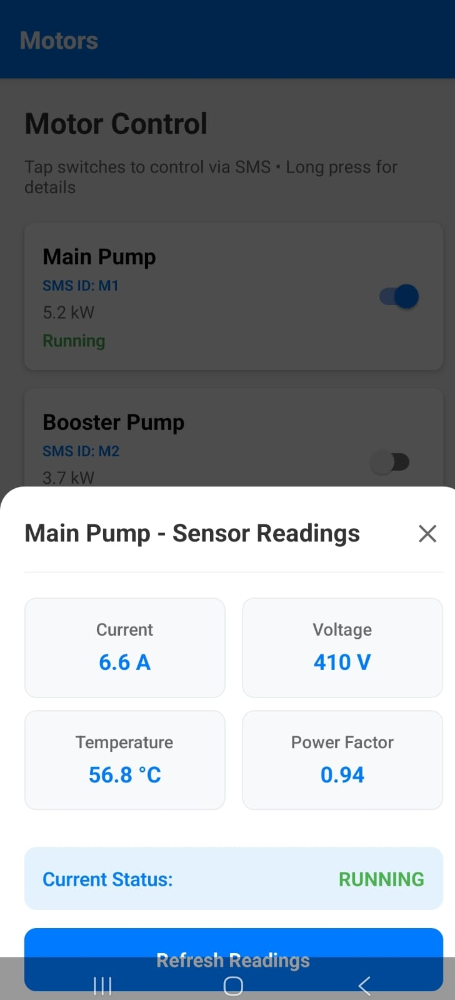
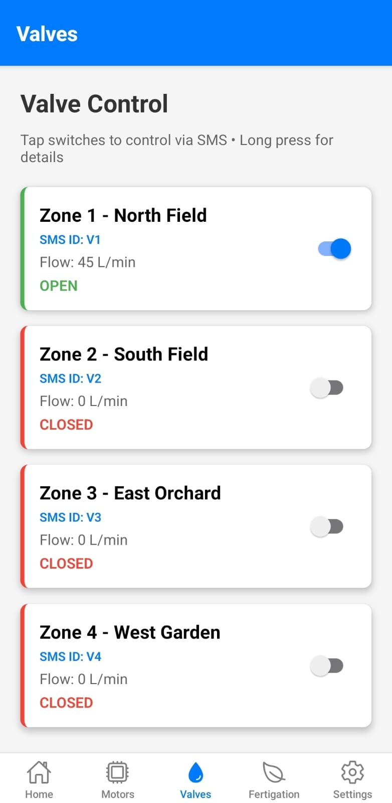
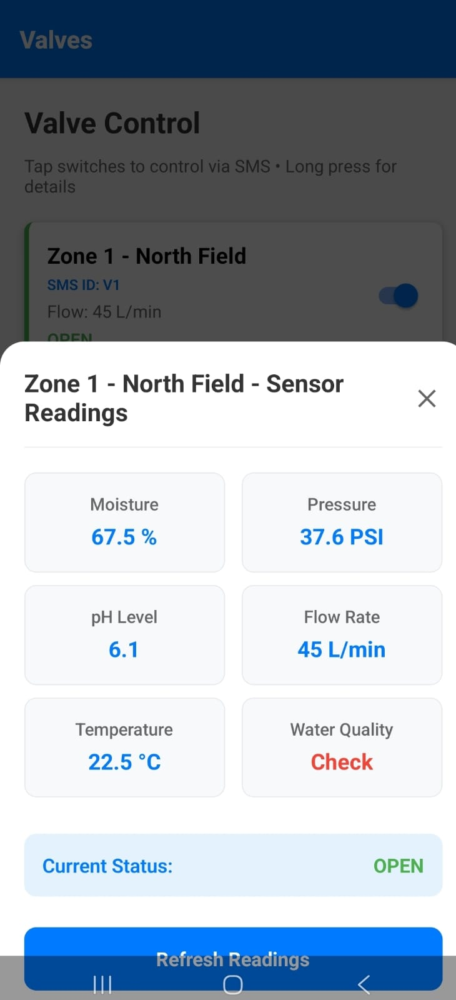
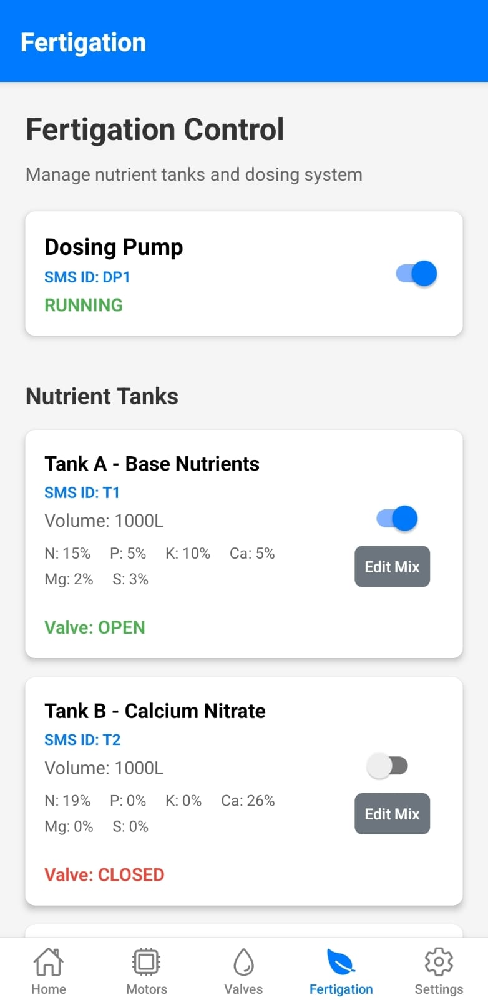
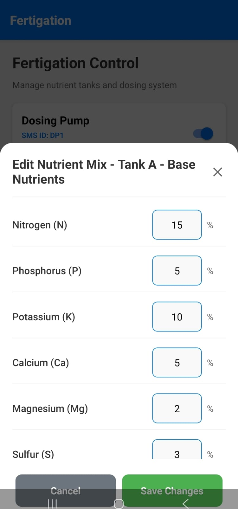
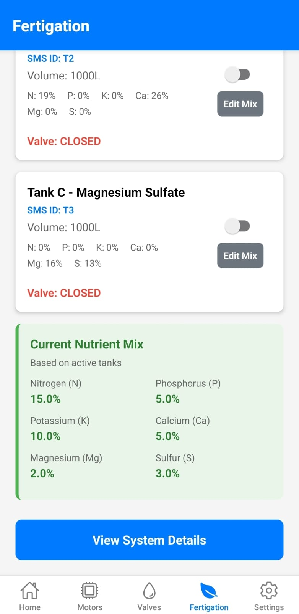
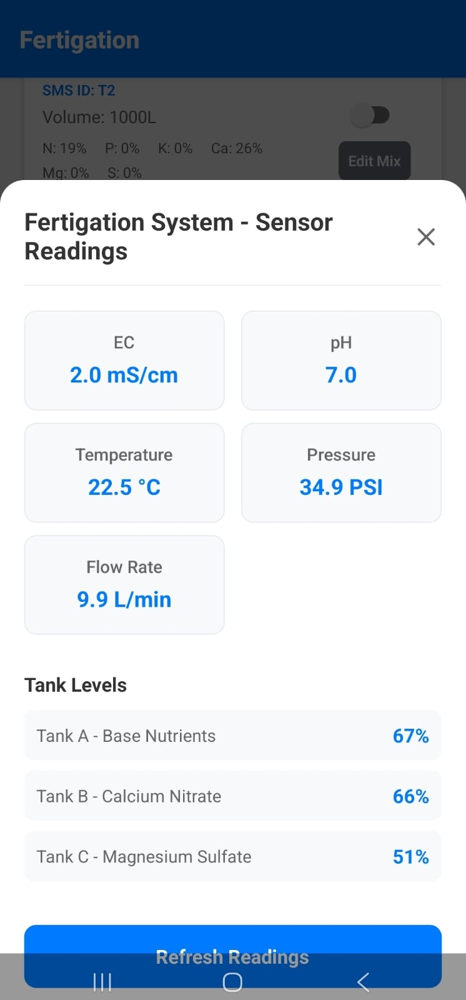

# Irrigation Control App

A cross-platform mobile application built with React Native and Expo for managing irrigation systems. The app provides a user-friendly interface to control and monitor motors, valves, and fertigation systems.

## Features

- 🏠 **Dashboard**: Overview of system status and quick actions
- ⚙️ **Motor Control**: Monitor and control irrigation motors
- 🚰 **Valve Management**: Manage multiple irrigation valves
- 🌱 **Fertigation**: Control and monitor fertigation systems
- ⚡ **Real-time Updates**: Live status of all components
- 🌐 **Cross-platform**: Works on iOS, Android, and web

## Screenshots

<div style="display: flex; flex-wrap: wrap; gap: 10px; justify-content: center;">
  <div style="text-align: center;">
    
    <p>Dashboard</p>
  </div>
  <div style="text-align: center;">
    
    <p>Motor Control</p>
  </div>
  <div style="text-align: center;">
    
    <p>Motor Sensor Readings</p>
  </div>
  <div style="text-align: center;">
    
    <p>Valve Management</p>
  </div>
  <div style="text-align: center;">
    
    <p>Valve Sensor Readings</p>
  </div>
  <div style="text-align: center;">
    
    <p>Fertigation</p>
  </div>
  <div style="text-align: center;">
    
    <p>Fertigation mix</p>
  </div>
  <div style="text-align: center;">
    
    <p>Current Nutrient Mix</p>
  </div>
  <div style="text-align: center;">
    
    <p>Fertigation sensor readings</p>
  </div>
</div>

## Prerequisites

- Node.js (v16 or later)
- npm or yarn
- Expo CLI (`npm install -g expo-cli`)
- For mobile development:
  - **iOS**: Xcode (macOS only)
  - **Android**: Android Studio
  - **Web**: Any modern web browser
- Expo Go app (for testing on physical devices)

## Installation

1. Clone the repository:

   ```bash
   git clone https://github.com/yourusername/irrigation-control-app.git
   cd irrigation-control-app
   ```

2. Install dependencies:

   ```bash
   npm install
   # or
   yarn install
   ```

3. Start the development server:

   ```bash
   npm start
   # or
   yarn start
   ```

4. Run on your preferred platform:
   - iOS: Press `i` in the terminal (requires Xcode)
   - Android: Press `a` in the terminal (requires Android Studio)
   - Web: Press `w` in the terminal

## Project Structure

```
src/
  ├── contexts/     # State management
  ├── navigation/   # Navigation configuration
  ├── screens/      # App screens
  │   ├── HomeScreen.tsx
  │   ├── MotorsScreen.tsx
  │   ├── ValvesScreen.tsx
  │   ├── FertigationScreen.tsx
  │   └── SettingsScreen.tsx
  └── utils/        # Utility functions
```

## Dependencies

- React Native (v0.81.5)
- React Navigation (v7)
- Expo (v54)
- TypeScript
- Expo Vector Icons
- React Native Paper (for UI components)
- AsyncStorage (for local storage)

## Building for Production

### Using EAS (Expo Application Services) - Recommended

1. Install EAS CLI (if not already installed):

   ```bash
   npm install -g eas-cli
   ```

2. Configure your project (if not already configured):

   ```bash
   eas build:configure
   ```

3. Build for both platforms:

   ```bash
   # For Android
   eas build --platform android

   # For iOS (requires macOS)
   eas build --platform ios
   ```

### Using Expo Build (Classic)

```bash
# Build for Android
npx expo build:android

# Build for iOS (requires macOS)
npx expo build:ios
```

### Creating Standalone Apps

1. Update `app.json` with your app's configuration
2. Run the appropriate build command above
3. Follow the prompts to complete the build process in the Expo cloud

## Contributing

1. Fork the repository
2. Create a new branch (`git checkout -b feature/AmazingFeature`)
3. Commit your changes (`git commit -m 'Add some AmazingFeature'`)
4. Push to the branch (`git push origin feature/AmazingFeature`)
5. Open a Pull Request

## License

This project is licensed under the MIT License - see the [LICENSE](LICENSE) file for details.

## Support

For support, email support@example.com or open an issue in the GitHub repository.

---

Built with ❤️ using React Native, Expo, and TypeScript
